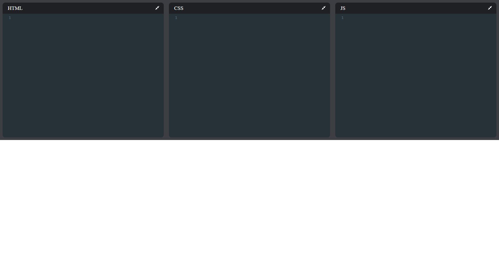
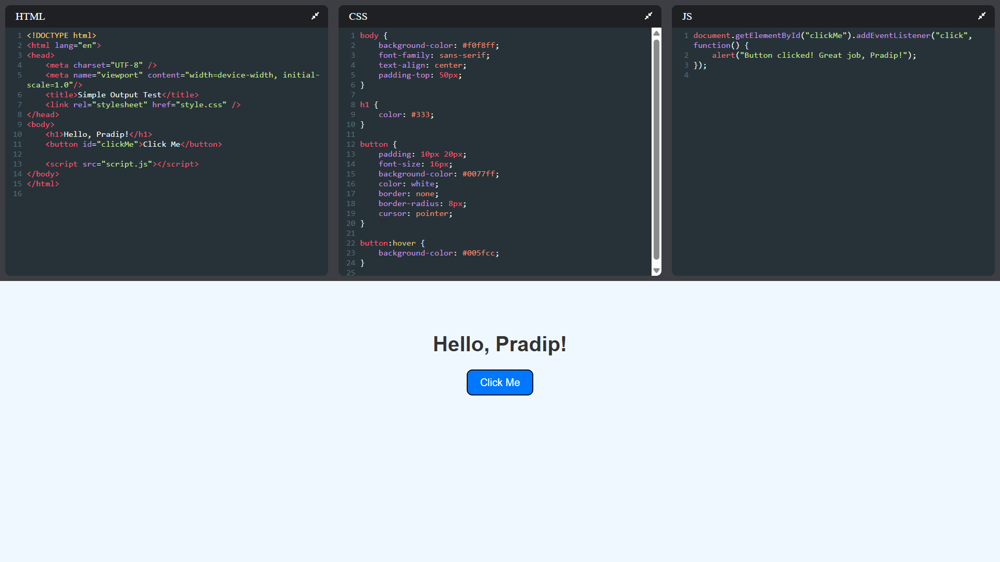

# React CodePen Clone

🚀 A lightweight online code editor built with React, supporting real-time HTML, CSS, and JavaScript preview – just like CodePen!

## Features

✅ Real-time code editing and preview  
✅ Supports HTML, CSS, JavaScript  
✅ Clean, beginner-friendly codebase  
✅ Perfect for practicing and sharing code snippets

## Installation

Clone the repository:

```bash
git clone https://github.com/Pradipd1/react-codepen-clone.git
cd react-codepen-clone
npm install
npm start
```
## 🖼️ Demo Screenshots

### 📝 Code Editor Interface


### 📤 Output Preview



## Deployment

## 🚀 Live Demo

Check out the live demo: mycodepen-clone.vercel.app


## License

MIT

---


